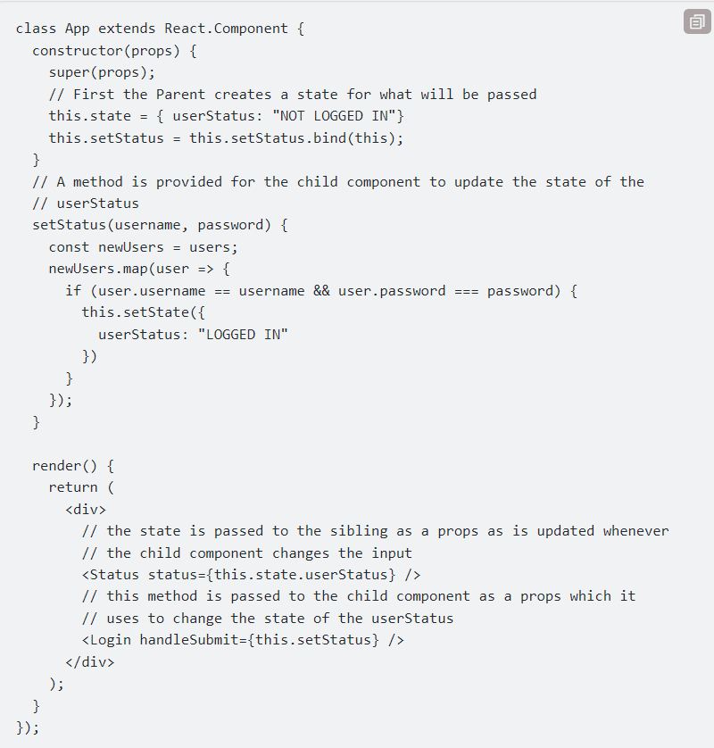
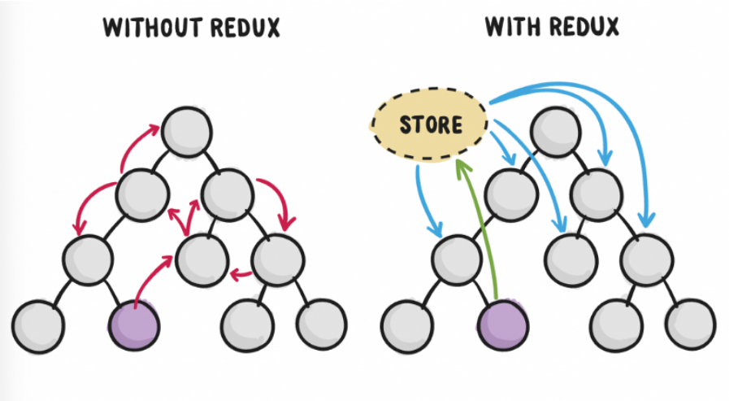
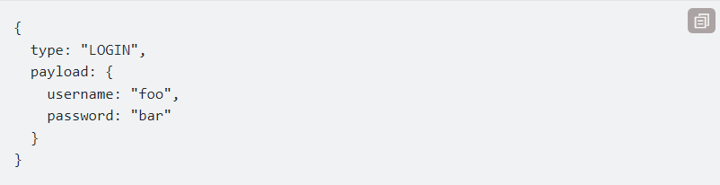
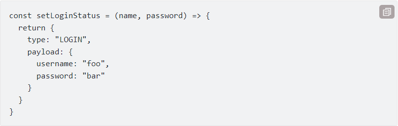
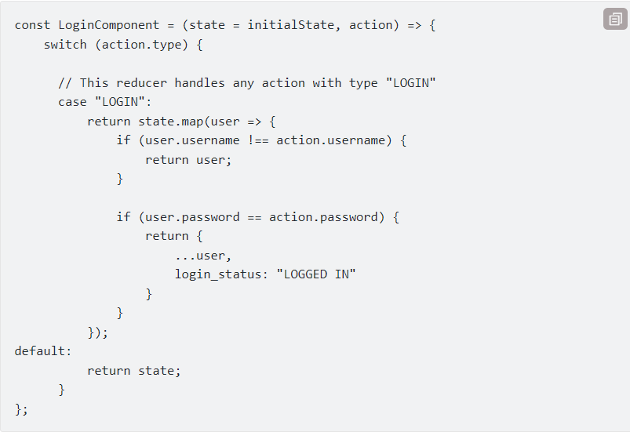
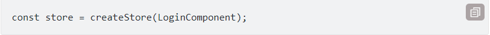
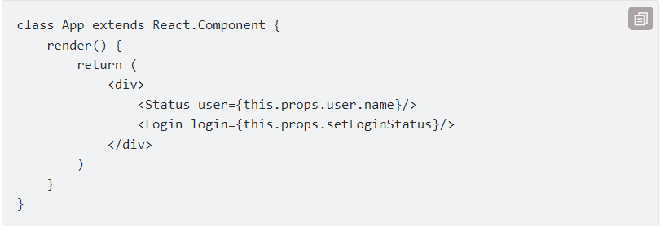
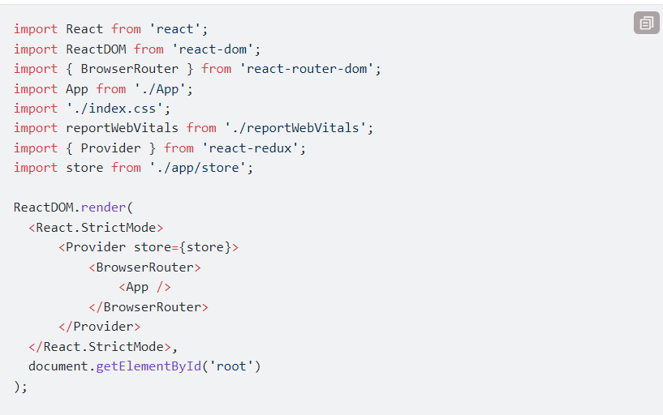

## Redux là gì?

Redux là một công cụ quản lý trạng thái. Mặc dù nó được sử dụng chủ yếu với React, nhưng nó có thể được sử dụng với bất kỳ khung hoặc thư viện JavaScript nào khác.

Với Redux, trạng thái ứng dụng của bạn được giữ trong một "store" và mỗi thành phần có thể truy cập bất kỳ trạng thái nào mà nó cần từ "store"này.

## Khi nào thì dùng Redux:

- Nếu bạn có một cấu trúc các thành phần như trên — dữ liệu được luân chuyển xuống nhiều tầng — hãy cân nhắc dùng Redux.

- Nếu bạn cần lưu — cache dữ liệu giữa các view. Ví dụ, tải về dữ liệu khi người dùng click vào trang chi tiết, và lưu dữ liệu lại để lần sau vào lại trang đó nhanh hơn — cân nhắc dùng Redux.

## Tại sao cần một công cụ quản lý trạng thái.

Trong một ứng dụng nơi dữ liệu được chia sẻ giữa các thành phần, có thể khó để biết thực sự biết một trạng thái nên sử dụng ở đâu. Lý tưởng nhất là dữ liệu trong một thành phần chỉ nên dùng trong một thành phần, do đó việc chia sẻ dữ liệu giữa các thành phần trở nên khó khăn.

Một ví dụ về Login trong React

## Mô hình hoạt động

Cách Redux hoạt động rất đơn giản. Có một "store" trung tâm chứa toàn bộ trạng thái của ứng dụng. Mỗi thành phần có thể truy cập trạng thái được lưu trữ mà không phải gửi từ thành phần này sang thành phần khác.

Có ba phần xây dựng: actions, store, and reducers. Hãy nói ngắn gọn về cách hoạt động của từng loại. Điều này rất quan trọng vì chúng giúp chúng ta hiểu được lợi ích của Redux và cách sử dụng nó.

## Actions trong Redux

Nói một cách đơn giản, action là sự kiện. Chúng là cách duy nhất bạn có thể gửi dữ liệu từ ứng dụng của mình đến "store" Redux. Dữ liệu có thể là từ các tương tác của người dùng, các lệnh gọi API hoặc là gửi form.

Các hành động được gửi bằng phương thức store.dispatch(). Các hành động là các đối tượng JavaScript đơn giản và chúng phải có thuộc tính loại để chỉ ra loại hành động sẽ được thực hiện. Họ cũng phải có một "payload" có chứa thông tin cần được xử lý bằng hành động. Hành động được tạo thông qua Action Creator.

Dưới đây, một ví dụ về hành động có thể được thực hiện trong quá trình đăng nhập trong ứng dụng:

Dưới đây là một ví dụ về Action Creator

Như đã giải thích trước đó, action phải chứa thuộc tính và sau đó thành phầnkhác sẽ được "payload" lưu trữ.

## Reducers trong Redux

Reducers là các hàm thuần túy lấy trạng thái hiện tại của ứng dụng, thực hiện một hành động và trả về trạng thái mới. Các trạng thái này được lưu trữ dưới dạng đối tượng và chúng xác định trạng thái của ứng dụng thay đổi như thế nào để đáp ứng với hành động được gửi đến "store".

Nó dựa trên hàm "reduce" trong JavaScript, trong đó một giá trị được tính từ nhiều giá trị sau khi thực hiện chức năng gọi lại.

Ví dụ :

Vì là các hàm thuần túy, chúng không thay đổi dữ liệu trong đối tượng được truyền cho chúng hoặc thực hiện bất kỳ tác dụng phụ nào trong ứng dụng. Cho cùng một đối tượng, chúng phải luôn tạo ra cùng một kết quả.

## Store trong Redux

Các "store" giữ trạng thái ứng dụng. Chỉ có một "store" trong bất kỳ ứng dụng Redux nào. Bạn có thể truy cập trạng thái được lưu trữ, cập nhật trạng thái và đăng ký hoặc hủy đăng ký "listeners" thông qua các phương thức trợ giúp.

Tạo store cho việc đăng nhập:

Các hành động được thực hiện trên trạng thái luôn trả về một trạng thái mới. Vì vậy, quản lý trạng thái là rất dễ dàng và có thể dự đoán.

Bây giờ chúng ta đã biết thêm một chút về Redux, hãy quay lại ví dụ thành phần đăng nhập đã được triển khai trước đó và xem Redux có thể cải thiện thành phần như thế nào.

Với Redux, có một trạng thái chung trong store và mỗi thành phần có quyền truy cập vào trạng thái. Điều này giúp loại bỏ sự cần thiết phải liên tục chuyển trạng thái từ thành phần này sang thành phần khác.

## Tích hợp Redux vs React App

Đầu tiên tạo project React
Sau đó tải 2 module redux `npm install redux` và `npm install react-redux --save`

Sau khi cài đặt thành công chúng ta có thể bắt đầu sử dụng redux trong dự án của mình rồi !

Bạn có thể tìm hiểu về các thành phân quan trọng của redux ở bài viết giới thiệu về Redux ở trên. Chúng ta sẽ làm việc trong thư mục `src`.

Mỗi thư mục sẽ có các nhiệm vụ khác nhau :

- `const`: chứa các hằng số cố định của dự án.
- `actions`: chứa các actions dùng để truyền vào hàm dispatch.
- `reducers`:chứa các reducers trong redux.

- Cách cung cấp store cho react
  

## Redux Toolkit là gì ?

- Redux Toolkit là một thư viện giúp mình viết Redux tốt hơn, dễ hơn và đơn giản hơn. (tiêu chuẩn để viết Redux)
- Tạo 1 Project sau đó tải thư viện React và cài đặt `npm install @reduxjs/toolkit`
-
